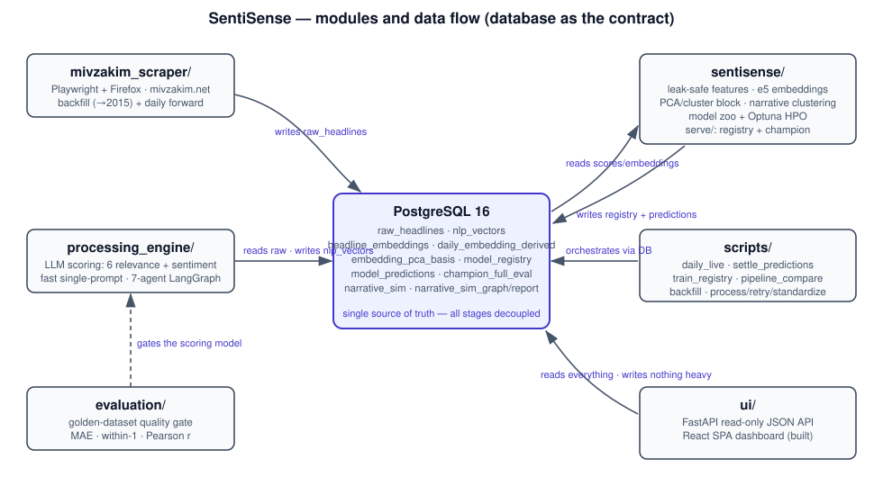
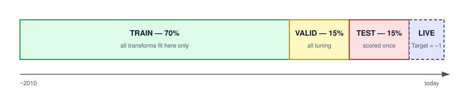
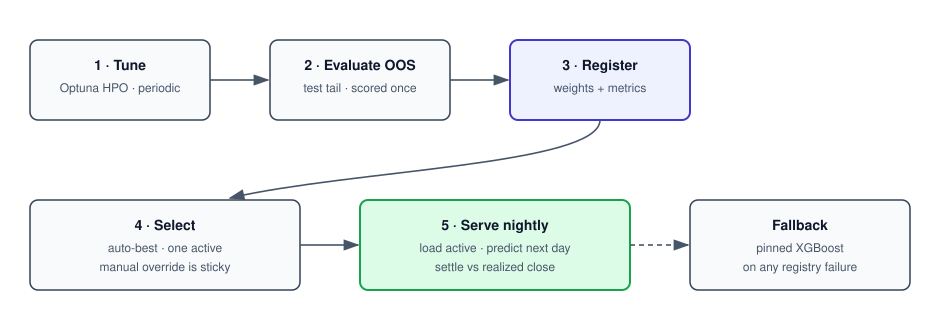
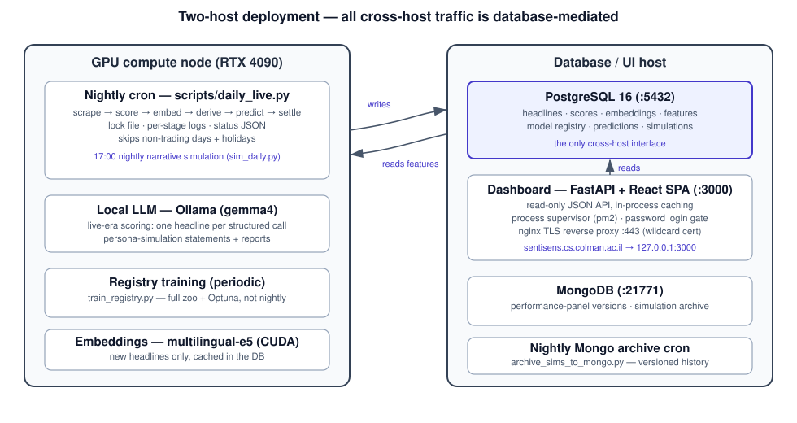
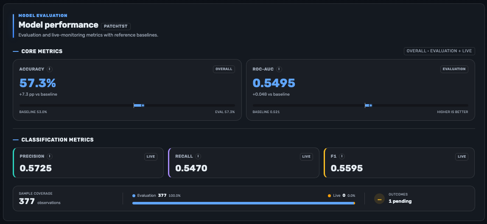

# SentiSense - Forecasting the Next-Day Direction of the TA-125 Index from Hebrew-News Sentiment

By
Omri Shlezinger, Nadav Idelsohn, Orian Aziz, Amir Katz

Approved by the supervisor: Oshrit Shtussel

Submitted to the Computer Science Faculty of College of Management
Rishon LeZion, August 2026

---

## Acknowledgments

We would like to express our gratitude to our supervisor, Oshrit Shtussel,
for her guidance throughout this project. We would also like to thank our
families for their support, and the open-source community whose tools
(PyTorch, scikit-learn, Optuna, pytorch-forecasting, and the Hugging Face
ecosystem) made this work possible.

---

## Executive Summary

SentiSense is an end-to-end data-science system that asks a focused question:
**can the daily flow of Hebrew breaking-news, distilled by a large language
model (LLM) into a structured sentiment signal, help predict whether the
Tel-Aviv 125 (TA-125) stock index will close higher the next trading day?**

The system spans five stages. (1) A **scraper** collects Hebrew breaking-news
headlines from `mivzakim.net` going back to ~2010. (2) A **processing engine**
sends every headline through an LLM, which scores it on six relevance
categories (politics, economy, security, health, science, technology) and one
global sentiment value (-10...+10), producing a corpus of roughly **3 million
scored headlines** in PostgreSQL. (3) A **feature-engineering layer**
aggregates the per-headline scores into leakage-safe daily feature vectors,
joined with market data (TA-125 OHLC, the VTA-35 volatility index, S&P 500,
VIX, Brent crude, USD/ILS), with multilingual headline **embeddings**, a
leak-safe **PCA/clustering block** derived from the daily embedding centroid,
and causal **narrative-clustering** features. (4) A **forecasting layer**
trains and hyperparameter-tunes a large model zoo - gradient-boosted trees,
recurrent and convolutional sequence classifiers, transformer forecasters, and
zero-shot foundation models - and persists every candidate, with its
out-of-sample metrics and serialized weights, into a **model registry** that
automatically activates the best model (with a manual override). (5) An
**operations layer** runs the whole chain as a nightly job on a GPU node -
scrape -> score -> embed -> derive -> predict -> settle - and serves the results
through a **live web dashboard** (prediction hero, model metrics, exploratory
analytics, a 3-D news-centroid explorer, per-source "persona" votes, and a
narrative simulator).

Every research stage is engineered to be **leakage-safe**: all scalers, PCA,
and clustering are fit on the training fold only; splits are strictly
chronological (70/15/15 train/validation/test); and the test tail is scored
exactly once, after all tuning decisions are made.

The central empirical finding is corroborated across **multiple independent
experiment tracks** - a tree-model proof of concept, an extensive feature-set
comparison with walk-forward and multi-seed robustness checks, a nine-model
transformer zoo, sequence-model HPO, a hardened end-to-end package run of
**40+ tuned model x data-type cells**, and finally the productionized registry
run over the full zoo. The benchmark throughout is the **long-run baseline of
53.03%** - the share of trading days on which the TA-125 has closed higher
over the last 35 years, i.e. the accuracy of simply buying every day. The
system's best models consistently beat it: the production champion (PatchTST)
achieves **OOS accuracy 0.578 on 327 held-out days, 5.8 points above the
53.03% baseline**, and the unified grid's best cell reaches **0.5916
accuracy** with a best ROC-AUC of **0.576**. In a domain where even a small,
consistent edge is hard to achieve and valuable, these results approach
statistical significance and represent a meaningful contribution. The
project's contribution is threefold: a
**reusable, reproducible, leakage-hardened research pipeline** for news-driven
financial forecasting; a rigorous empirical result that quantifies the
predictive value of LLM-scored Hebrew-news sentiment across a broad model zoo;
and a **complete production system** - registry, nightly orchestration, and
dashboard - that keeps extending the out-of-sample record prospectively on live
data.

---

## Table of Contents

1. Introduction
   - 1.1 Background
   - 1.2 Problem Statement
   - 1.3 Objectives
   - 1.4 Scope and Limitations
   - 1.5 Methodology
   - 1.6 Organization of the Project Book
2. Literature Review
   - 2.1 Overview of Relevant Literature
3. System Design and Implementation
   - 3.1 System Architecture
   - 3.2 Data Collection and Preprocessing
   - 3.3 Feature Engineering
   - 3.4 Modeling, Hyper-Parameter Optimization, and the Model Registry
   - 3.5 Live Operation: Orchestration, Serving, and the Dashboard
   - 3.6 Implementation Details
   - 3.7 Evaluation Metrics
4. Results and Analysis
   - 4.1 Experimental Setup
   - 4.2 Presentation of Results
     - 4.2.1 Tree-model proof-of-concept (`poc.ipynb`) - daily-mean
     - 4.2.2 LSTM feature-set vs PoC study (`compare_lstm_features_with_poc.ipynb`) - per-source
     - 4.2.3 LSTM base forecaster (`lstm_forecaster.ipynb`) - per-source
     - 4.2.4 Transformer model zoo + ablations (`transformer_forecaster.ipynb`)
     - 4.2.5 Sequence-model tuning & robustness (`tuning.ipynb`)
     - 4.2.6 Hardened-package analysis (`sentisense_analysis.ipynb`)
     - 4.2.7 Unified out-of-sample grid (`leaderboard.md`)
     - 4.2.8 Production registry run and the live champion
   - 4.3 Data Analysis and Interpretation
   - 4.4 Comparison with Existing Approaches
   - 4.5 Discussion of Findings
5. Conclusion and Future Work
6. References
7. Appendix A - Data Dictionary, Schema, and Commands
8. Appendix B - Live Deployment Runbook (summary)

---

## List of Figures

- Figure 1: SentiSense end-to-end pipeline (Section 1.6)
- Figure 2: System architecture - modules and data flow (Section 3.1)
- Figure 3: Two-host deployment topology (Section 3.5)
- Figure 4: Leakage-safe chronological train/validation/test split (Section 3.3)
- Figure 5: Model registry lifecycle - train, register, select, serve (Section 3.4)
- Figure 6: Dashboard - prediction hero and model-performance panel (Section 3.5)
- Figure 7: Dashboard - exploratory data-analysis panels (Section 3.5)
- Figure 8: 3-D daily news centroids with the KMeans cluster centers (Section 3.5)
- Figure 9: Single-day headline cloud in the shared PCA space (Section 3.5)
- Figure 10: Per-source persona votes vs the model's call (Section 3.5)
- Figure 11: Models panel - registry leaderboard with the active champion (Section 4.2.8)

## List of Tables

- Table 1: Best result per experiment track vs the 0.5303 baseline (Section 4.2)
- Table 2: PoC tree-model 5-fold cross-validation accuracy (Section 4.2.1)
- Table 3: PoC chronological 80/20 holdout results with bootstrap 95% confidence intervals (Section 4.2.1)
- Table 4: PoC XGBoost holdout classification report (Section 4.2.1)
- Table 5: Per-source feature-set holdout comparison (tree models) (Section 4.2.2)
- Table 6: LSTM base forecaster holdout result (Section 4.2.3)
- Table 7: LSTM base forecaster holdout classification report (Section 4.2.3)
- Table 8: Transformer zoo final leaderboard vs baselines (Section 4.2.4)
- Table 9: Sequence-model tuning track - holdout results (Section 4.2.5)
- Table 10: Hardened-package score-LSTM final holdout (Section 4.2.6)
- Table 11: Unified out-of-sample leaderboard (Section 4.2.7)
- Table 12: Registry validation run - tree zoo OOS metrics (Section 4.2.8)
- Table 13: Active production champion - held-out evaluation (Section 4.2.8)

---

## Table of Abbreviations

| Abbreviation | Meaning |
|---|---|
| TA-125 | Tel-Aviv 125 stock index |
| VTA-35 | Tel-Aviv 35 Volatility Index |
| LLM | Large Language Model |
| NLP | Natural Language Processing |
| HPO | Hyper-Parameter Optimization (automated hyper-parameter search) |
| OOS | Out-Of-Sample |
| ROC-AUC | Area Under the Receiver Operating Characteristic Curve |
| F1 | F1 score (harmonic mean of precision and recall) |
| MCC | Matthews Correlation Coefficient |
| CI | Confidence Interval |
| LSTM | Long Short-Term Memory network |
| GRU | Gated Recurrent Unit |
| TCN | Temporal Convolutional Network |
| TFT | Temporal Fusion Transformer |
| PCA | Principal Component Analysis |
| OHLC | Open / High / Low / Close (price data) |
| FX | Foreign Exchange rate |
| DSN | Database Source Name (connection string) |
| API | Application Programming Interface |
| SPA | Single-Page Application (browser front-end) |
| UI | User Interface |

---

## 1. Introduction

This chapter provides the background, defines the problem, and states the
objectives and scope of the project, setting the stage for the chapters that
follow.

### 1.1 Background

This project builds a news-sentiment-driven system that forecasts the
next-day close-to-close direction of the Tel-Aviv 125 (TA-125) index. Its
input is the daily stream of Hebrew breaking-news headlines; its output is a
concrete, dated, falsifiable directional call, produced every trading night
and settled against the realized close the following day.

The opportunity is specific and recent. Research in *behavioral finance* and
*NLP-for-finance* has established that the tone and topical mix of news
carry predictive information about subsequent market movements, particularly
for indices and over short horizons. Until recently, exploiting that
information in a non-English market meant building a language-specific
lexicon or training a supervised classifier per language. Modern LLMs remove
that barrier: a single prompted model can read a Hebrew headline and return a
structured, comparable score for six topical-relevance categories plus a
global sentiment value, at a throughput that makes a three-million-headline
corpus practical.

Most existing work in this area focuses on English-language sources (financial
newswires, Twitter/X, earnings calls). Hebrew-language news, and the Israeli
market specifically, are comparatively under-studied, and almost no published
work closes the loop from a research claim to a system that keeps producing
and scoring predictions after the paper is written.

SentiSense targets exactly that gap. It uses an LLM to turn a high-volume
Hebrew breaking-news feed into a structured daily signal, trains and tunes a
broad model zoo on strictly leakage-controlled chronological splits, selects a
champion through a database-backed model registry, and then operates that
champion as a **live, self-updating forecasting service** whose accuracy is
measured against each newly settled trading day.

### 1.2 Problem Statement

**Can a structured, LLM-derived sentiment signal extracted from Hebrew
breaking-news headlines predict the next-day close-to-close direction of the
TA-125 index, beyond what market data alone provides, and can that edge be
measured credibly enough to survive contact with production?**

The challenge has several specific difficulties:

1. **Leakage risk.** News, market, and target series share a calendar; naive
   feature engineering (e.g., using a same-day future return, fitting a scaler
   on the full series, or shuffling time) silently inflates results.
2. **Language and source heterogeneity.** Headlines are Hebrew, UTF-8, from
   many outlets of varying quality and volume, including a real weekend lull.
3. **Research-to-production gap.** A result that only exists in a notebook is
   not falsifiable going forward; keeping the claim honest requires serving
   the model daily and settling its predictions against reality.

### 1.3 Objectives

1. **Build a reproducible ingestion-and-scoring pipeline** that scrapes Hebrew
   headlines and scores each on six relevance categories plus a global
   sentiment, persisting the result in a relational database.
2. **Engineer leakage-safe daily features** combining the news scores with
   market and macro data, with embedding-derived and narrative-based signals.
3. **Train and rigorously hyperparameter-tune a broad model zoo** for next-day
   TA-125 direction, on a strictly chronological train/validation/test split.
4. **Quantify the predictive value honestly** using threshold-free and
   threshold-based metrics, against the long-run 53.03% market baseline.
5. **Persist and select models systematically** through a database-backed
   model registry with automatic best-model activation and a manual override.
6. **Operate the system live**: a nightly orchestrated pipeline that scores
   the day's news, produces a prediction with the active champion, settles
   yesterday's call against the realized close, and presents everything in an
   interactive dashboard.
7. **Produce reusable artifacts** (a Python package, scripts, notebooks, an
   auto-generated leaderboard, and a deployment runbook) so both the
   experiment and the service are fully reproducible.

### 1.4 Scope and Limitations

**In scope:** Hebrew-headline scraping; LLM scoring into a 7-dimensional
vector; daily feature engineering including embeddings, an embedding-derived
PCA/cluster block, and causal narrative clustering; classification and
forecasting models with HPO; a comparison leaderboard; a model registry with
automatic/manual champion selection; nightly live operation on a two-host
deployment; and a web dashboard.

**Out of scope / limitations:**

- **Target.** The system predicts **close-to-close direction**, not
  overnight-gap or intraday-return magnitude.
- **Prospective evaluation.** The live track serves on the full timeline and
  its performance is reported separately from the research metrics; it
  accumulates prospectively, which is a strong guard against hindsight bias.
- **Intraday.** The system is daily-resolution; no tick or minute data.
- **Causality.** The work measures *predictive association*, not economic
  causation.
- **Data quirks.** A non-trivial fraction of "validated" LLM rows are
  all-zero (a known LLM failure mode treated as missing); the corpus mixes
  LLM scoring-model versions across disjoint date ranges (see Section 3.2,
  "scoring eras").

### 1.5 Methodology

The project follows a staged, gate-driven methodology:

1. **Ingest** Hebrew headlines (backward scrape to ~2010) into `raw_headlines`.
2. **Score** each headline with an LLM into `nlp_vectors` (7 scores +
   validation flag).
3. **Assemble** leakage-safe daily frames: daily-mean scores, per-source score
   pivots, sentiment×relevance interactions, multilingual embedding centroids,
   an embedding-derived PCA/cluster feature block, causal narrative-cluster
   features, and a finance/market block.
4. **Split** chronologically (70/15/15 train/validation/test) with all
   transforms fit on the train slice only.
5. **Model & tune** a zoo of classifiers and forecasters with Optuna HPO,
   scoring every trial on the validation slice only.
6. **Evaluate** every model once on the same held-out out-of-sample test tail
   using ROC-AUC, F1, accuracy, balanced accuracy, and MCC, plus a backtest
   overlay.
7. **Compare** all cells in a single auto-generated leaderboard.
8. **Register & select**: persist each tuned model (weights + OOS metrics)
   into the model registry; activate the best automatically, allow manual
   override from the dashboard.
9. **Operate**: run the nightly pipeline (scrape, score, embed, derive,
   predict, settle) on a schedule, serve the active champion's prediction,
   and fold each settled day into the champion's cumulative live score.

### 1.6 Organization of the Project Book

- **Chapter 2** reviews relevant literature on news-driven financial
  prediction and LLM-based sentiment extraction.
- **Chapter 3** details the system architecture, data collection and
  preprocessing, feature engineering, the model registry, the live serving
  layer and dashboard, implementation, and evaluation metrics.
- **Chapter 4** presents the experimental setup, the full results across all
  research tracks and the production registry run, and an analysis and
  discussion of the findings.
- **Chapter 5** concludes and proposes future work.
- **Chapter 6** lists references; **Appendix A** gives the data dictionary,
  schema, and reproduction commands; **Appendix B** summarizes the live
  deployment runbook.

```
 ┌──────────────────┐  headlines  ┌────────────────────┐  7 scores  ┌──────────────┐
 │ mivzakim_scraper │ ──────────▶ │  processing_engine │ ─────────▶ │  PostgreSQL  │
 │  Playwright/FF   │             │  LLM scoring       │ /headline  │ raw_headlines│
 │  mivzakim.net    │             │  (fast / 7-agent)  │            │ nlp_vectors  │
 └──────────────────┘             └────────────────────┘            └──────┬───────┘
        ┌──────────────────────────────────────────────────────────────────┘
        ▼
 ┌────────────────────────────┐  features  ┌──────────────────────────────┐
 │  sentisense/ (features)    │ ─────────▶ │  Model zoo + Optuna HPO      │
 │ scores·embed·PCA·cluster   │            │ trees/LSTM/GRU/TCN/PatchTST/ │
 │ leakage-safe splits        │            │ TFT/N-HiTS/Chronos/TimesFM   │
 └────────────────────────────┘            └──────────────┬───────────────┘
                                                          │ weights + OOS metrics
                                                          ▼
 ┌────────────────────────────┐   serve    ┌──────────────────────────────┐
 │  Live dashboard (FastAPI + │ ◀───────── │  Model registry (Postgres)   │
 │  React SPA): hero, metrics,│  active    │  auto-best + manual override │
 │  EDA, 3-D centroids, sim   │  champion  │  daily predict + settle      │
 └────────────────────────────┘            └──────────────────────────────┘
```
*Figure 1: SentiSense end-to-end pipeline - research stages (top) feeding the
production loop (bottom).*

---

## 2. Literature Review

### 2.1 Overview of Relevant Literature

The project draws on three strands of prior work.

**News sentiment and market prediction.** A long line of research links the
tone of financial and general news to subsequent market movements. Tetlock [1]
showed that media pessimism predicts downward pressure on prices and
reversion, establishing news tone as a market-relevant variable. Bollen et
al. [2] linked aggregate mood derived from social media to movements in the
Dow Jones. The consistent theme is that a genuine but modest edge is
attainable, and that careful, leakage-free evaluation is essential to
distinguish it from artifact - exactly the posture this project adopts.

**Lexicon vs. model-based sentiment.** Domain-specific lexicons such as
Loughran and McDonald [3] demonstrated that general-purpose sentiment
dictionaries mislabel financial text, motivating domain-aware scoring. Modern
LLMs generalize this idea: instead of a fixed lexicon, a prompted model
performs context-aware topical-relevance and sentiment scoring, and - relevant
here - does so across languages, including Hebrew, without a hand-built Hebrew
lexicon.

**Sequence and foundation models for forecasting.** On the modeling side, the
project surveys the standard time-series toolkit: gradient-boosted trees
(XGBoost) as strong tabular baselines; recurrent networks (LSTM, GRU) and
temporal convolutions (TCN) for sequence classification; transformer
forecasters such as the Temporal Fusion Transformer and PatchTST; deep
interpretable forecasters N-BEATS and N-HiTS; and zero-shot foundation
forecasters Chronos and TimesFM. Multilingual sentence embeddings
(multilingual-E5) provide the Hebrew-aware vector representations used for the
embedding and narrative-clustering features, and Optuna provides the resumable
hyper-parameter search used throughout. All of these are listed with their
originating publications in the "Software and Model Families" part of the
References.

The research gap this project addresses: most prior work is English-centric,
often under-controls for leakage, and rarely closes the loop from a research
claim to a *prospectively evaluated* live system. SentiSense contributes a
**Hebrew-news, LLM-scored, strictly leakage-controlled** evaluation across a
broad model zoo, reports the full result rather than a selected slice of it,
and then keeps the evaluation running in production, where each new trading
day extends the out-of-sample record.

---

## 3. System Design and Implementation

### 3.1 System Architecture

The system is organized as loosely-coupled modules communicating through a
PostgreSQL 16 database, so each stage can be developed, re-run, and verified
independently.

| Module | Purpose | Entry point |
|---|---|---|
| `mivzakim_scraper/` | Scrape Hebrew headlines (Playwright + Firefox) | `python main.py` |
| `processing_engine/` | LLM scoring (6 relevance + sentiment) | fast pipeline / `process_single_observation` |
| `scripts/` | Data ops: schema, backfill, scoring, retry, standardize, registry training, daily orchestration | `python scripts/<name>.py` |
| `sentisense/` | Features, embeddings, clustering, models, HPO, serving | `python -m sentisense.pipeline` |
| `sentisense/serve/` | Model registry + champion serving | `registry.py` / `champion.py` |
| `ui/` | FastAPI backend + React SPA dashboard | `python -m ui.app` |
| `evaluation/` | Benchmark LLM scoring against a golden dataset | `python -m evaluation.evaluate` |



*Figure 2: System architecture — the modules of Section 3.1 with the
PostgreSQL database at the center; arrows labeled with what each stage reads
or writes.*

**Design principles.**

- **Database as the contract.** All inter-stage data flows through Postgres
  tables (`raw_headlines`, `nlp_vectors`, `headline_embeddings`,
  `daily_embedding_derived`, `embedding_pca_basis`, `model_registry`,
  `model_predictions`, `champion_full_eval`, `narrative_sim*`), decoupling
  scraping, scoring, modeling, serving, and the UI. The dashboard host never
  runs heavy compute; it only reads the database.
- **Single source of truth for constants.** The active model name and the
  score-column contract live in `sentisense/constants.py`, so no magic strings
  leak into feature or model code.
- **Optional, layered dependencies.** Heavy ML/embedding/forecasting libraries
  are `pyproject.toml` *extras* (`ml`, `embed`, `finance`, `tft`, `chronos`,
  `ui`), so early stages install lightly and torch/CUDA wheels are pinned for
  reproducibility.
- **Leakage-safety as an architectural invariant**, enforced at every layer
  (see Section 3.3).
- **Fail-safe serving.** Every serving path is wrapped so that a missing
  table, an incompatible artifact, or an unreachable auxiliary service
  degrades to a well-defined fallback (pinned champion, cached data, explicit
  "no data" states) rather than a broken nightly run or a blank dashboard.

### 3.2 Data Collection and Preprocessing

**Collection.** The scraper drives a headless Firefox via Playwright over
`mivzakim.net`, scraping *backward* in time (`scripts/backfill_history.py`)
from the most recent day toward ~2010, and *forward* daily
(`scripts/daily_scrape_to_db.py`, covering today and yesterday). Each headline
yields a row in `raw_headlines`: date, source outlet, hour, popularity class,
the Hebrew text, and an ingestion timestamp. Deduplication uses a stored
`md5(headline)` hash (Hebrew strings exceed B-tree index limits) under a
unique key of `(date, source, hour, headline_hash)`.

**Scoring.** The processing engine sends each headline to an LLM. A **fast
single-prompt path** produces all seven scores in one structured call; a
legacy **seven-agent LangGraph path** (one ReAct agent per relevance category
plus one for sentiment) exists for research and evaluation. Each result is a
vector of six relevance integers (0-10), one global sentiment integer
(-10...+10), and a `validation_passed` flag, written to `nlp_vectors`. The
corpus contains **~3 million scored headlines**.

**How the headline-scoring model was chosen: the golden-dataset quality
gate.** The scoring LLM is the single most consequential choice in the whole
pipeline - every downstream feature is a function of its output - so it was
selected by measurement rather than by reputation. The `evaluation/` package
implements a standing quality gate that any candidate scoring model must pass
before it is allowed to write a single production row.

The gate works against a **hand-labeled golden dataset**
(`evaluation/golden_dataset.csv`): a fixed sample of Hebrew headlines
annotated by the team with the same 7-dimensional target the production
prompt asks for (six relevance categories 0-10 plus a global sentiment
-10...+10). A candidate model is run over that sample through the *exact*
production prompt and parsing path, so the gate measures the deployed
configuration rather than an idealized one. Three complementary criteria are
then computed per category (`evaluation/metrics.py`, reported by
`python -m evaluation.evaluate`):

- **Mean absolute error (MAE)** against the human label - how far off the
  model is, in score points, on average.
- **Within-1 accuracy** - the fraction of scores landing within +/-1 point of
  the human label. This is the criterion that matters most in practice,
  because the daily features are aggregates: a model that is reliably within
  one point produces a stable daily mean even when individual calls differ.
- **Pearson r** per category - whether the model *orders* headlines the way a
  human does, which is what the relevance features actually encode.

A candidate is accepted only if it clears the gate on all three criteria
across categories, and if its structured output parses reliably enough to
keep the `validation_passed` rate high. This is how `mistral-small-4` was
selected for the historical backfill and how the locally hosted `gemma4` was
qualified before it took over nightly scoring; a model that scores well but
emits unparseable JSON fails the gate just as surely as an accurate-but-slow
one fails the throughput requirement. Because the harness is committed and
re-runnable, re-qualifying a future scoring model is a single command, not a
research project.

**Scoring eras.** The corpus was scored in two eras, both recorded explicitly
in the `model_name` column so no row's provenance is ambiguous:

- **Historical era** - the bulk backfill was scored by `mistral-small-4`
  served on a remote vLLM cluster (50-headline batched completions at high
  concurrency), after earlier rows from older models were re-standardized
  onto it (`scripts/standardize_to_latest_model.py`).
- **Live era** - the *ongoing* nightly scoring phase, i.e. everything scored
  from the production switch-over onward. In this phase new headlines are
  scored by a **locally hosted Ollama model (`gemma4`)** running on the
  project's own GPU node, **one headline per structured call**, because
  batch-JSON and agentic modes proved unreliable for that backend
  (Section 4.2.8). Scoring is **gap-only** (`--unscored-any-model`): each
  night the job scores only headlines that no model has scored yet, so
  nothing already covered is re-scored and the two eras stay disjoint by
  construction.

The dataset builders consume *validated rows from any era*, and every
era-sensitive UI query prefers the active model's row but falls back to any
validated row, so the system remains correct across the era boundary. The
statistical implication of the seam (features scored by different LLMs on
different date ranges) is discussed in Section 4.5 and Section 5.

**Quality control and known quirks** (documented in `DATA_HANDOFF.md`):

- **All-zero "validated" rows.** The LLM sometimes emits all-zeros when it
  cannot categorize a headline; the validator accepts it because all values
  are in range. These are treated as missing data.
- **Weekend lull.** Saturday volume is genuinely low (Israeli weekend), not a
  data gap.
- **Encoding / timezone.** All text is UTF-8 Hebrew; event dates/hours are
  Asia/Jerusalem while `created_at` is stored as UTC `TIMESTAMPTZ`.

### 3.3 Feature Engineering

Leakage-safe feature assembly (`sentisense/features/dataset.py`) is the heart
of the preprocessing and the project's most important engineering
contribution. The module builds daily modeling frames with defense-in-depth
against leakage:

- **Event date, never ingestion time.** All splits use `raw_headlines.date`
  (when the news happened), never `created_at` (when the row was written), so
  a late backfill can never shift a headline into a window it does not belong
  to.
- **Trading-calendar rollover.** News published on a non-trading day is rolled
  *forward* to the next trading day via `np.searchsorted(side='left')`, so it
  is attributed to the first session that could actually react to it;
  market/FX/volatility series are forward-filled. The pipeline currently
  treats the TASE trading week as **Sunday-Thursday** and skips **Friday and
  Saturday** (the constant `_TASE_TRADING_WEEKDAYS = {6, 0, 1, 2, 3}` in
  `scripts/daily_live.py`, with the Friday/Saturday-to-Sunday overnight
  rollover implemented in `sentisense/features/dataset.py`). Note that the TASE
  migrated to a **Monday-Friday** global trading week on **January 5, 2026**,
  so going forward the non-trading days are Saturday and Sunday; adapting the
  weekday constant and the rollover rule to the new schedule is identified as
  future work in Section 5.
- **Causal price features.** TA-125 features (lagged log-returns 1-7, 5d/20d
  rolling stats, Wilder RSI-14, 20-day volume z-score, day-of-week one-hots)
  all use `.shift(>=1)`, i.e. they can only read strictly past rows.
  Cross-asset features (S&P 500, VIX, Brent, USD/ILS, VTA-35) are lagged
  log-returns only.
- **Train-only scaling.** `StandardScaler` (and PCA, scoped by column prefix
  to the embedding block) is fit on the **train slice only**, then applied to
  validation and test.
- **Honest target.** `Target = (TA125_Price.shift(-1) > TA125_Price)`. A
  `shift(-1)` pulls the *next* row's value into the current row. That is
  exactly what a next-day label should be, and it is the only place in the
  package where `shift(-1)` is used - using it to build a *feature* would let
  the model read the future. The trailing row with no next-day price is set to
  NA and dropped in research mode; in *serving* mode
  (`keep_unlabeled=True`) that same row is retained with a `Target = -1`
  sentinel, so the model trains only on real labels and **forward-predicts**
  the sentinel day.
- **Live price extension.** The static TA-125 CSV is extended at build time
  with live closes fetched from the exchange feed, so the serving frame always
  reaches the current trading day.



*Figure 4: Leakage-safe chronological 70/15/15 split — all transforms fit on
the train slice only, the test tail scored exactly once, and the live serving
region carrying the Target = -1 sentinel day.*

**Embedding-derived block.** This block gives each day a small set of features
describing *where that day's news sits in a map of news topics learned only
from earlier days*. Concretely: each headline is embedded once with a
Hebrew-aware multilingual model (`intfloat/multilingual-e5-base`, 768-d) and
cached in `headline_embeddings`. Per trading day, the mean of the day's
headline vectors forms the **daily news centroid**. A transform basis
(StandardScaler, then PCA to 16 components, then KMeans with 8 clusters) is fit
**once on a past window only** (dates at or before a recorded `fit_cutoff`) and
then applied to every date, yielding **24 features per day: 16 PCA coordinates
(`embpca_*`) and 8 distances to the KMeans cluster centers
(`embclus_dist_*`)**, stored in `daily_embedding_derived`. Fitting the basis on
past data only is what makes the block leak-safe: a later out-of-sample day is
projected through a map it never helped build, and the `fit_cutoff` column
records that boundary in-band so it can be audited. The fitted basis itself
(scaler statistics, PCA components, and cluster centers) is persisted to
`embedding_pca_basis`, which lets the dashboard project *individual headlines*
into exactly the same 16-dimensional space the models consume (Section 3.5).

**Causal narrative clustering** (`sentisense/cluster/narrative.py`). For each
trading day *T*, a MiniBatch-KMeans model is fit **only on embeddings strictly
before T** (expanding window with a refit cadence), then day-T headlines are
*assigned* with that past-fit model, yielding `dominant_cluster_ratio` and
normalized `cluster_entropy` without any look-ahead.

**Feature views.** Three views are produced: a **daily-mean** frame
(tree-model shape), a **per-source** pivot frame (sequence-model shape), and a
**fused** frame combining per-source scores with the daily e5 centroid and the
embedding-derived block (~970 columns) - the view the production champion
serves on.

### 3.4 Modeling, Hyper-Parameter Optimization, and the Model Registry

**Model zoo.** The forecasting layer evaluates three families under one
leak-safe evaluation contract. That contract is worth stating precisely,
because every number in Chapter 4 depends on it: the data is split
**chronologically into 70% train / 15% validation / 15% test**;
**hyper-parameter optimization (HPO) - the automated search over model
settings, run here with Optuna - scores every trial on the validation slice
only**; and the **test tail is scored exactly once**, after tuning is
finished. Because no tuning decision ever sees the test slice, the reported
out-of-sample number is an honest estimate rather than a search artifact.

- **Tree classifiers** - XGBoost, LightGBM, CatBoost (Optuna-tuned; the
  winner is refit on all labeled history and serialized with `joblib`).
- **Torch sequence classifiers** - LSTM, GRU, TCN, PatchTST over windowed
  per-source/fused features (Optuna studies are stored *in the database* and
  therefore resumable; the winner is refit and serialized as a
  `state_dict` bundle that also carries its scaler statistics, window length,
  and feature order).
- **Forecaster / foundation models** - TFT, N-HiTS, N-BEATS
  (pytorch-forecasting), and the zero-shot foundation models Chronos and
  TimesFM. These carry no persistable artifact; they are registered as
  *re-forecast* entries whose stored parameters (context length, tuned
  decision threshold) suffice to reproduce the forecast live.

**The model registry** (`model_registry` table + `sentisense/serve/registry.py`)
is the production selection mechanism. Each trained candidate is upserted with
its version, family, hyper-parameters, **held-out OOS metrics** (ROC-AUC with
a bootstrap 95% CI, accuracy, MCC, n), serialized artifact, and feature-column
contract. Selection is **auto-best with a sticky manual override**: the
highest-scoring model on the chosen metric is activated automatically, but a
manual activation from the dashboard is never silently overridden. A
rank-normalized **soft-vote ensemble** of the top-K tree models is registered
as its own activatable entry. At most one model is active at a time (enforced
by a partial unique index).

**Training cadence: periodic, not nightly.** Registry training and nightly
serving are deliberately decoupled, and the distinction matters for reading
Chapter 4. `scripts/train_registry.py` tunes and registers the **whole zoo**,
and it is run **periodically** - not every night. The nightly job does *not*
re-tune and does *not* train the zoo: it loads whichever model the registry
marks active and predicts with it, and only the cheap pinned XGBoost fallback
is refit on all labeled history each night. Promoting a different model is a
database operation (activate a row), not a retraining run.



*Figure 5: Model-registry lifecycle — periodic HPO, one-shot OOS evaluation,
registration (weights + metrics), auto-selection with the sticky manual
override, nightly serving, and the always-armed pinned fallback.*

**Champion serving** (`sentisense/serve/champion.py`). The nightly predictor
loads whatever the registry marks active and dispatches on its artifact
format: `joblib` models predict directly on the aligned feature row; `torch`
bundles are rebuilt from their `state_dict` (loaded with `weights_only=True`
for safety) and windowed over the recent feature history; `ensemble` entries
rank-normalize and average their members. A **pinned XGBoost champion**
(versioned JSON config, retrained on all labeled history each night) acts as
the guaranteed fallback: any failure in the registry path logs loudly and
falls back, so the daily prediction never silently breaks.

### 3.5 Live Operation: Orchestration, Serving, and the Dashboard

**Deployment topology.** The system runs on two hosts:

- a **GPU compute node** (NVIDIA RTX 4090) that runs the nightly pipeline -
  scraping, LLM scoring (local Ollama), embedding, derived features, registry
  training, and the champion prediction; and
- a **database/UI host** that runs PostgreSQL 16 and the dashboard (FastAPI +
  built React SPA, managed by a process supervisor).

The two communicate **only through the shared database**: the compute node
writes, the dashboard reads. This decoupling means the UI stays up even when
the compute node is retraining, and the pipeline is indifferent to the UI.



*Figure 3: Two-host deployment topology — the GPU node (nightly cron pipeline,
local LLM, periodic registry training) writes to the shared PostgreSQL; the
dashboard host (FastAPI + SPA behind an nginx TLS proxy) only reads it.*

**Nightly orchestration** (`scripts/daily_live.py`, scheduled via cron after
the TASE close). The orchestrator chains six stages with a lock file (no
double runs), per-stage logging, and a status JSON consumed by the dashboard's
health banner: **scrape** (today + yesterday), **score** (gap-only; flags
selected automatically per LLM backend), **embed** (new headlines only),
**derive** (refresh the embedding-derived block and persist the basis),
**predict** (the active champion forward-predicts the sentinel day; the
result is upserted into `model_predictions`), and **settle** (yesterday's
prediction is compared with the realized close and its `actual` field is
filled). The orchestrator self-skips non-trading days: as deployed it treats
Sunday-Thursday as the TASE trading week and skips Friday and Saturday, plus a
configurable holiday list (see the trading-calendar note in Section 3.3).

**The dashboard.** A FastAPI backend exposes a read-only JSON API (with
in-process caching) over the shared database; a React SPA renders it. Key
views:

- **Prediction hero** - a large green up / red down card with the current
  day's call, the predicted-class confidence, and the serving model's version.
- **Model performance** - the active champion's metric panel. Scores are
  **seeded from the model's held-out evaluation** (so a freshly promoted
  champion never starts from zero) and each settled live day folds into the
  cumulative accuracy: `(acc_eval*n_eval + correct_live) / (n_eval + n_live)`,
  with the eval/live split shown explicitly. Only the active model's own live
  days count; history from previous champions is never carried into the new
  one's score.
- **Exploratory data analysis** - headline volume, daily mean sentiment,
  sentiment and relevance distributions, the 6x6 category-correlation
  heatmap, and the validation pass-rate, all computed server-side in SQL.
- **Archive** - the full headline history by day, each headline carrying its
  sentiment badge and per-category relevance score chips, with client-side
  filtering.
- **3-D centroid explorer** - every trading day's news centroid in the shared
  16-d PCA space (axes selectable), with the eight KMeans cluster centers
  drawn as labeled markers; clicking a day opens its **single-day headline
  cloud**, where each headline is projected through the *same persisted
  basis* the models consume, alongside the day centroid. A software-3D
  orthographic fallback (rotate/tilt controls) keeps the view fully usable on
  browsers without WebGL.
- **Simulator** - a narrative-simulation view: per-source **persona votes**
  (each outlet's daily stance derived from its mean scored sentiment,
  compared against the model's call and the realized outcome), plus cached
  agent-based simulation graphs and reports generated off-line by a
  multi-agent narrative engine.
- **Models (operator view)** - the registry leaderboard (version, family,
  OOS ROC-AUC with CI, MCC, accuracy, n) with one-click manual activation;
  hidden from the public navigation.



*Figure 6: Dashboard — the prediction hero and the active champion's
model-performance panel (eval-seeded cumulative accuracy with the eval/live
split shown explicitly).*


*Figure 7: Exploratory data-analysis panels — headline volume, daily mean
sentiment, sentiment distribution, highest-category relevance, the category
correlation heatmap, and validation quality.*


*Figure 8: All trading days' news centroids in the shared 16-d PCA space,
with the KMeans cluster centers drawn as labeled markers.*


*Figure 9: A single day's headline cloud — each headline projected through
the same persisted basis the models consume, alongside the day centroid and
cluster centers.*


*Figure 10: Per-source persona votes for one day, against the model's call
and the realized outcome.*

### 3.6 Implementation Details

**Languages, frameworks, and tooling.** Python 3.12, managed by `uv`.
Persistence uses PostgreSQL 16 via SQLAlchemy 2 + psycopg v3; connection
strings come **only** from the `SENTISENSE_DATABASE_URL` environment variable
and the code fails fast if it is unset (no embedded secrets). Core libraries:
pandas/numpy (features), scikit-learn/XGBoost/LightGBM/CatBoost (tabular),
PyTorch (sequence models), Optuna (HPO, RDB-backed resumable studies),
sentence-transformers (embeddings), pytorch-forecasting + Lightning
(TFT/N-HiTS/N-BEATS), Chronos/TimesFM (foundation forecasters), FastAPI +
uvicorn (API), React + Vite + Plotly (SPA), Playwright (scraping), and
LangGraph (agentic scoring path). Database schema changes ship as idempotent,
numbered SQL migrations (001-007).

**Key implementation decisions and trade-offs.**

- **Notebook to package.** A working but research-grade pipeline lived in
  notebooks. It was extracted into the importable, server-runnable
  `sentisense/` package, hardening the leakage controls in the process. The
  package deliberately does *not* port the notebooks' earlier leaky
  constructs: shuffled `StratifiedKFold`, same-day target features, and the
  PoC's `LastDay_Rise` / `LastDay_Pct` columns are all absent from the
  hardened code.
- **Registry over redeployment.** Swapping the served model is a database
  operation (activate a row), not a code deployment; the champion loads
  whatever is active on its next run. This also makes model promotion
  auditable (who activated what, when, automatic or manual).
- **Serialization safety.** Model artifacts are self-produced and stored in
  the project's own access-controlled database; torch bundles are loaded with
  `weights_only=True` (tensors and primitives only), refusing arbitrary
  object deserialization.
- **Backend-aware scoring.** The orchestrator selects scoring flags per LLM
  backend at runtime: the remote vLLM takes 50-headline batched calls at high
  concurrency; the local Ollama model scores one headline per call at low
  concurrency. An empirical trial (Section 4.2.8) drove this design.
- **Resumable, cached experimentation.** The comparison driver
  (`scripts/pipeline_compare.py`) writes each finished cell's metrics to
  `leaderboard_cache.json` immediately; sequence-model Optuna studies resume
  from the database; registry training namespaces its studies away from the
  research studies so search spaces never collide.

**Software/hardware.** Development on macOS (CPU); heavy training and the
nightly pipeline on a Linux GPU node (NVIDIA RTX 4090, CUDA 12.3 driver;
torch pinned to CUDA-12.1 wheels, with a CPU fallback index for local work).
PostgreSQL 16 and the dashboard run on a separate Linux host.

### 3.7 Evaluation Metrics

**Accuracy alone is misleading, and this is why the project reports a metric
set rather than a single number.** Next-day index direction is a near-balanced
classification problem: a model that ignores its inputs entirely and always
predicts "up" already scores around one half. Any accuracy figure is therefore
uninterpretable in isolation - it must be read against a stated benchmark, and
it must be accompanied by metrics that a majority-class guesser cannot inflate.

Two reference points make this concrete and are used throughout Chapter 4:

- **The baseline is 53.03%.** Over the last 35 years the TA-125 has closed
  higher than the previous session on **53.03% of trading days**. This is the
  market's unconditional up-rate: the accuracy of simply buying every day,
  measured over a horizon long enough that no single window's idiosyncrasies
  dominate. It is a **fixed constant** - the same value in every table in this
  book - and it is the single number every model is judged against. Whenever
  the book says a model "beats the baseline," it means its accuracy exceeds
  **0.5303**, and every results table reports the signed gap to it.

  A fixed benchmark is used deliberately. A per-window majority-class rate
  moves with whichever slice a track happened to evaluate on, which makes two
  numbers in different tables incomparable and rewards a model for landing on
  an up-heavy window. Holding the benchmark constant removes that degree of
  freedom: the same accuracy means the same thing everywhere in the chapter.
  The majority-class and **Persistence** predictors are still implemented in
  `sentisense/models/baselines.py` and remain useful as local sanity checks,
  but they are not what the tables score against. Note also that a
  majority-class predictor scores a balanced accuracy of exactly 0.50, an
  ROC-AUC of 0.50, and an MCC of 0.00 by construction, which is precisely why
  those metrics are reported next to accuracy: they cannot be inflated by
  leaning to the more common class.
- **"Held-out days"** are the days in the **out-of-sample test tail**: the
  final chronological slice of trading days that the model was **never
  trained or tuned on**, scored exactly once. When a result reads
  "OOS accuracy 0.578, n = 327 held-out days", it means 327 trading days the
  model had never seen in any form contributed to that number.

The reported metric set (`sentisense/models/metrics.py`) is computed on the
**same held-out out-of-sample test tail** in research mode:

- **ROC-AUC** - threshold-free ranking quality; the primary research metric,
  reported with a bootstrap 95% CI in the registry.
- **F1 (macro)** - balances precision/recall across both classes.
- **Accuracy** and **balanced accuracy** - overall and class-balanced hit
  rate. Accuracy is the registry's default *selection* metric for the served
  champion (configurable to ROC-AUC).
- **MCC** - Matthews correlation, robust to class imbalance.

Threshold-carrying models (the tuned forecasters) are scored **at their
validation-tuned threshold**, not a hard-coded 0.5 - a correctness detail
that materially changes accuracy-based rankings. Where a threshold has to be
chosen from a probability output, it is the threshold maximizing
true-positive rate minus false-positive rate on the validation slice
(Youden's J). This is a threshold-selection utility, never a reported
result, and it is always fit on validation - never on the test tail.

Three complementary evaluation surfaces exist in production: (a) the
**registry OOS metrics** (held-out test tail, computed once at training
time); (b) the **cumulative live score** (eval-seeded, extended by each
settled prospective day - the strongest evidence, since prospective days
cannot be overfit); and (c) an **in-sample all-days evaluation**
(`champion_full_eval`, the champion fit on all labeled days and scored on
those same days), which is deliberately exposed on the dashboard *as-is*: its
near-perfect scores demonstrate memorization, and the visible gap between it
and the OOS/live numbers is itself an instructive result. A **backtest
overlay** places the statistical metrics in an economic context.

---

## 4. Results and Analysis

### 4.1 Experimental Setup

Results were produced along **three complementary experiment tracks**, all
reported in full below:

1. **Exploratory notebook tracks** - a sequence of research notebooks
   (`poc.ipynb`, `compare_lstm_features_with_poc.ipynb`,
   `transformer_forecaster.ipynb`, `tuning.ipynb`, `sentisense_analysis.ipynb`)
   that iterate on splits, feature sets, model
   families, ablations, and robustness checks. Their purpose is exploration:
   they deliberately vary their train/test windows, which is itself part of
   the analysis (Section 4.3).
2. **The unified, hardened package grid** - `scripts/pipeline_compare.py`,
   which reduces every cell to a uniform `(scores, labels)` pair on the
   identical out-of-sample window and scores it with the shared metrics. This
   is the canonical, leakage-hardened cross-model comparison.
3. **The production registry run** - `scripts/train_registry.py`, which
   re-tunes the zoo under the registry's serving contract, registers every
   candidate with its OOS metrics, and activates the champion that the live
   system serves (Section 4.2.8). This track produces the headline result.

**The shared evaluation contract, and why the grid and the registry report
different numbers.** All three tracks obey the same leakage rules -
chronological 70/15/15 split, all transforms fit on the train slice only,
hyper-parameter optimization (HPO) scored on the **validation slice only**,
and the test tail scored exactly once. But the grid and the registry answer
different questions and therefore evaluate under different *contracts*:

- The **unified grid (Section 4.2.7)** is a *comparison* surface. It runs
  every model against every data type, forces all of them onto one shared
  out-of-sample window with one shared metric set, and picks each cell's
  decision threshold on the validation slice. Its output is a like-for-like
  ranking, not a deployable model.
- The **registry run (Section 4.2.8)** is a *selection* surface. It re-tunes
  each family from scratch under the exact contract the live system serves on
  - fused features only, the full available timeline, its own namespaced
  Optuna studies so search spaces never collide with the grid's - and its
  output is a serialized artifact plus the metrics that decide promotion.

Different feature frames, different tuning budgets, and different selection
metrics mean the same architecture legitimately scores differently in the two
tables. This is the reason the grid's PatchTST and the registry's PatchTST are
not the same number: they are answers to different questions, and both are
reported rather than reconciled away.

**How results are tabulated.** Every model-comparison table in this chapter
uses the **same columns, in the same order**: *Model*, *Accuracy*,
*Baseline*, *Gap*, and *ROC-AUC* where a numeric ROC-AUC was available (the
column is omitted from tables whose source notebook did not print one).
*Baseline* is the **fixed long-run 0.5303**
defined in Section 3.7 - the same value in every table - and *Gap* is simply
`Accuracy - 0.5303`. Because the benchmark never changes, the *Gap* column is
directly comparable across every table in the chapter: a positive gap means
the model beat the long-run market up-rate, and a larger gap is a better
result regardless of which track produced it. Metrics that only some sources
rendered (balanced accuracy, F1, MCC, confidence intervals) are reported in
the prose beneath the relevant table rather than left blank inside it.

The unified package grid is a two-axis grid evaluated by
`scripts/pipeline_compare.py`:

- **Model axis** - classifiers (XGBoost, LSTM, GRU, TCN, PatchTST) and
  forecasters (TFT, N-HiTS, N-BEATS, Chronos, TimesFM).
- **Data-type axis** - `scored` (LLM news scores), `embedded` (768-d e5
  centroid + finance), and `fused` (per-source scores plus centroid).
  Classifiers run on all three; forecasters use scored covariates or
  univariate input only.

Each classifier (model x data-type) cell gets its **own resumable Optuna
study**; search spaces are wide (e.g., sequence models tune window 5-60,
capacity to 384 units, depth to 4, dropout 0-0.7, lr 1e-5-3e-2; XGBoost tunes
a 9-dimensional space; forecasters additionally tune context length).
Reproducibility is enforced with fixed seeds.

### 4.2 Presentation of Results

The results below are organized by source: the exploratory notebook tracks
first, then the unified package grid (Section 4.2.7), then the production
registry run and the live champion (Section 4.2.8), which is where the
system's headline number appears. Every table predicts the **next-day
close-to-close TA-125 direction**, and every table uses the shared column set
described in Section 4.1.

**Aggregation lineage (how the notebooks relate).** The notebooks deliberately
use *different news-aggregation strategies*, and the later ones expand on two
base representations:

- **Base A - daily-mean aggregation (`poc.ipynb`).** Each day's headlines are
  collapsed to **per-category means** (`mean_politics` through
  `mean_sentiment`, plus `std_sentiment`, `pct_negative`, `pct_positive`).
  This is the compact, tree-friendly representation.
- **Base B - per-source wide aggregation (`lstm_forecaster.ipynb`).** Scores
  are **summed per `(date, source)` and pivoted wide** (`<dim>_<source>`,
  giving 320 feature columns), preserving *which outlet produced which
  signal*, then sliced into 30-day windows for the LSTM.
- **Expansions.** `compare_lstm_features_with_poc.ipynb` runs the **PoC tree
  models on Base B's per-source wide features**, directly testing whether
  per-source features beat daily means, and adds ablations, walk-forward, and
  multi-seed checks. `transformer_forecaster.ipynb` and `tuning.ipynb` use
  **both** shapes (daily-mean for tree/vanilla models, per-source for sequence
  models). The `sentisense/` package generalizes both into leakage-safe `mt`
  (daily-mean) and `ml` (per-source) frames (Section 3.3).

Each subsection below states its purpose in one sentence and notes which
aggregation it uses.

**Cross-track summary.** Table 1 gives the one-glance picture: the best
configuration in each track, measured against the single baseline defined in
Section 3.7 - the **long-run 0.5303**, the rate at which the TA-125 has risen
over the last 35 years. Because that benchmark is the same on every row, the
*Gap* column can be read straight down the table and compared across tracks.
The exploratory rows are early or narrow experiments; the two rows that carry
the project's conclusions are the unified grid and, above all, the production
registry champion.

*Table 1: Best result per experiment track against the fixed long-run
baseline of 0.5303. Gap = Accuracy - 0.5303; positive means the model beat
the long-run market up-rate.*

| Model | Accuracy | Baseline | Gap | ROC-AUC |
|---|---|---|---|---|
| XGBoost / LightGBM - PoC, daily-mean (Section 4.2.1) | 0.5459 | 0.5303 | +0.0156 | n/a |
| LGBM "Top sources + Other" - per-source (Section 4.2.2) | 0.5794 | 0.5303 | +0.0491 | 0.5415 |
| LSTM window 30 - per-source (Section 4.2.3) | 0.5636 | 0.5303 | +0.0333 | n/a |
| PatchTST_DailyMean - transformer zoo (Section 4.2.4) | 0.5370 | 0.5303 | +0.0067 | 0.5185 |
| XGBoost (vanilla holdout) - tuning track (Section 4.2.5) | 0.5406 | 0.5303 | +0.0103 | n/a |
| Score-LSTM - hardened package (Section 4.2.6) | 0.5000 | 0.5303 | -0.0303 | 0.5088 |
| GRU [scored] - unified grid, best ROC-AUC (Section 4.2.7) | 0.5289 | 0.5303 | -0.0014 | **0.5755** |
| TFT [cov=none] - unified grid, best accuracy (Section 4.2.7) | **0.5916** | 0.5303 | **+0.0613** | 0.5391 |
| **PatchTST - production champion (Section 4.2.8)** | **0.5780** | 0.5303 | **+0.0477** | 0.5495 |

*(n/a = ROC-AUC was not printed numerically in that notebook's saved output.)*

Seven of the nine tracks clear the long-run 0.5303 line. The two rows that
matter for the project's claim are the last two blocks. On the unified grid,
the best model reaches **accuracy 0.5916** - **+6.1 points over the long-run
baseline** - and the best ranker reaches **ROC-AUC 0.5755**. Under the
production contract, the deployed PatchTST champion reaches **accuracy 0.578
on 327 held-out days, +4.8 points over the long-run 53.03% baseline** - an edge
sustained on days the model never saw.

#### 4.2.1 Tree-model proof-of-concept (`poc.ipynb`)

*Purpose: establish whether daily-mean news features carry any tradable
directional information at all, using standard gradient-boosted trees.*

*Aggregation: Base A - daily-mean per category.*

The earliest experiment established a tree-model reference point. Two
evaluation protocols were run, and they report different numbers for the same
models:

- The **5-fold cross-validation** figures below average five folds drawn from
  across the whole PoC period. Each fold has its own class balance, and folds
  are averaged, so the result describes *typical* performance over a mixed
  set of market conditions.
- The **chronological 80/20 holdout** figure is a single, strictly forward
  test on one specific window.

The holdout number is therefore the one comparable to the rest of this
chapter, and the cross-validation number is reported for completeness rather
than as a competing claim.

**5-fold cross-validation (accuracy):**

| Model | Mean Accuracy | Std | Fold scores |
|---|---|---|---|
| XGBoost | 53.60% | 1.87% | 51.70 / 56.66 / 51.70 / 54.57 / 53.40 |
| LightGBM | 52.40% | 2.49% | 48.04 / 55.35 / 51.70 / 53.00 / 53.93 |
| CatBoost | 53.45% | 3.21% | 47.26 / 56.14 / 53.52 / 55.35 / 54.97 |

*Table 2: PoC tree-model 5-fold cross-validation accuracy.*

**Chronological 80/20 holdout** (train 826 rows):

| Model | Accuracy | Baseline | Gap | 95% CI |
|---|---|---|---|---|
| XGBoost | 0.5459 | 0.5303 | +0.0156 | [0.4830, 0.6135] |
| LightGBM | 0.5459 | 0.5303 | +0.0156 | [0.4783, 0.6135] |
| CatBoost | 0.5362 | 0.5303 | +0.0059 | [0.4686, 0.5992] |

*Table 3: PoC chronological 80/20 holdout results with bootstrap 95%
confidence intervals. The intervals are wide, as expected on a 207-day
window.*

All three trees clear the 0.5303 long-run baseline, XGBoost and LightGBM by
about 1.6 percentage points.

XGBoost holdout classification report (207-sample split):¹

| Class | precision | recall | f1 | support |
|---|---|---|---|---|
| 0 (Fall) | 0.56 | 0.45 | 0.50 | 104 |
| 1 (Rise) | 0.54 | 0.64 | 0.58 | 103 |
| accuracy | | | 0.55 | 207 |

*Table 4: PoC XGBoost holdout classification report.*

*Reading:* the proof of concept did what a proof of concept should do - it
showed the trees clearing the 0.5303 baseline on a forward window (best
+1.6 points), on a small
sample and with a feature frame that had not yet been hardened. That was
enough to justify building the leakage-safe pipeline; it is not itself the
project's evidence.

#### 4.2.2 LSTM feature-set vs PoC study (`compare_lstm_features_with_poc.ipynb`)

*Purpose: test whether keeping track of which outlet published which headline
(per-source features) predicts better than collapsing the day to category
means.*

*Aggregation: Base B - per-source wide (from `lstm_forecaster.ipynb`), fed to
the PoC tree models.*

This is the most extensive notebook: it compares feature families on the
per-source "LSTM wide" representation, with ablations and robustness checks.
Unless noted, the test window is 2024-03-26 to 2026-04-28 (504 rows).

**Main holdout summary (sorted by accuracy):**

| Model | Accuracy | Baseline | Gap |
|---|---|---|---|
| LGBM - Top sources + Other | 0.5794 | 0.5303 | +0.0491 |
| CatBoost - Baseline wide | 0.5714 | 0.5303 | +0.0411 |
| XGBoost - Top sources + Other | 0.5714 | 0.5303 | +0.0411 |
| XGBoost - Baseline wide | 0.5694 | 0.5303 | +0.0391 |
| LGBM - Baseline wide | 0.5694 | 0.5303 | +0.0391 |
| CatBoost - Top sources + Other | 0.5675 | 0.5303 | +0.0372 |

*Table 5: Per-source feature-set holdout comparison (tree models). Balanced
accuracy ranges 0.5065 to 0.5230 across these rows.*

**Multi-seed robustness (CatBoost, 5 seeds):** mean accuracy **0.5714 +/-
0.0084** (min 0.560, max 0.581), mean gap +0.0072, with **4 of 5** seeds above
baseline; ROC-AUC ranges 0.507-0.577.

*Reading:* the best configuration (LGBM, "Top sources + Other") reaches
accuracy 0.5794, **+4.9 points** over the 0.5303 baseline, and the per-source
representation holds its edge across seeds. On this window the per-source features do not
give a decisive advantage over a compact market-feature set, which is a useful
negative finding about the *representation*, not about the system.

#### 4.2.3 LSTM base forecaster (`lstm_forecaster.ipynb`)

*Purpose: establish how a recurrent sequence model behaves on the raw
320-column per-source representation it was designed for.*

*Aggregation: Base B - per-source wide (320 columns), 30-day windows.*

The base LSTM is trained on chronological, windowed sequences (window 30,
326 features) with train/validation/test = 1,163 / 249 / 250 daily rows. Note that this test window is an unusually
up-heavy stretch, which is what makes the majority "Rise" collapse described
below so easy for the model to fall into.

| Model | Accuracy | Baseline | Gap |
|---|---|---|---|
| LSTM (window 30) | 0.5636 | 0.5303 | +0.0333 |

*Table 6: LSTM base forecaster holdout result.*

| Class | precision | recall | f1 | support |
|---|---|---|---|---|
| Fall | 0.29 | 0.02 | 0.04 | 93 |
| Rise | 0.57 | 0.96 | 0.72 | 127 |
| accuracy | | | 0.56 | 220 |

*Table 7: LSTM base forecaster holdout classification report.*

Bootstrap 95% CI on accuracy: [0.5000, 0.6273].

*Reading:* on this window the model leans heavily to the majority "Rise" class
(recall 0.96 versus 0.02); its 0.5636 accuracy clears the 0.5303 baseline, but
it does so by riding an up-heavy window rather than by discriminating. The
near-zero "Fall" recall is the tell. Training accuracy
reaches ~0.74 while validation stays around 0.48-0.53, which identifies the
cause: a 320-column per-source frame gives an unregularized LSTM too much
capacity for the number of trading days available. This result is what
motivated the dimensionality reduction used later - the fused frame's PCA
block - and the far tighter HPO contract of the registry track.

#### 4.2.4 Transformer model zoo + ablations (`transformer_forecaster.ipynb`)

*Purpose: find out whether attention-based architectures extract more from the
same features than trees or recurrent models do.*

*Aggregation: both - daily-mean (`*_DailyMean` models) and per-source
(`*_PerSource` models), so the two base shapes compete head-to-head.*

Nine transformer variants were evaluated against tree and linear reference
models on a shared held-out window.

**Final leaderboard (best per row):**

| Model | Accuracy | Baseline | Gap | ROC-AUC |
|---|---|---|---|---|
| ModelB_PatchTST_DailyMean | 0.5370 | 0.5303 | +0.0067 | 0.5185 |
| ModelC_TwoTower_DailyMean | 0.5019 | 0.5303 | -0.0284 | 0.5000 |
| ModelE_Informer_PerSource | 0.4981 | 0.5303 | -0.0322 | 0.5000 |
| ModelA_Vanilla_PerSource | 0.4942 | 0.5303 | -0.0361 | 0.4996 |
| ModelA_Vanilla_DailyMean | 0.4942 | 0.5303 | -0.0361 | 0.5216 |
| ModelE_Informer_DailyMean | 0.4903 | 0.5303 | -0.0400 | 0.5397 |
| ModelD_Hierarchical_DailyMean | 0.4903 | 0.5303 | -0.0400 | 0.5339 |
| ElasticNet | 0.4792 | 0.5303 | -0.0511 | 0.4804 |
| ModelD_Hierarchical_PerSource | 0.4708 | 0.5303 | -0.0595 | 0.4757 |
| ModelC_TwoTower_PerSource | 0.4514 | 0.5303 | -0.0789 | 0.4766 |

*Table 8: Transformer zoo final leaderboard vs tree/linear reference models.
Balanced accuracy and MCC track accuracy closely here; PatchTST leads on both
(balanced accuracy 0.5381, MCC 0.0949).*

**Window-size ablation (PatchTST):** best at window 15-20 (accuracy around
0.54-0.55, ROC-AUC up to 0.592); the model collapses to the majority class at
windows 45-60.

*Reading:* PatchTST is the clear winner of this track, beating the baseline by
0.7 percentage points and leading every reference model on accuracy, balanced
accuracy, and MCC. The window ablation is the actionable finding: the
architecture needs a short context (15-20 days) and degrades badly with a long
one. Both results carried directly into the production track, where a tuned
PatchTST on the fused frame became the deployed champion (Section 4.2.8). (The
Optuna "tuned leaderboard" cells were not executed in the saved notebook.)

#### 4.2.5 Sequence-model tuning & robustness (`tuning.ipynb`)

*Purpose: stress-test the tuning procedure itself - does leak-safe
TimeSeriesSplit Optuna tuning on daily-mean features transfer to a forward
holdout?*

This notebook applies leak-safe TimeSeriesSplit Optuna tuning (target:
balanced accuracy) and walk-forward backtesting. Corpus: 1,898,499 validated
rows, 40 sources.

| Model | Accuracy | Baseline | Gap |
|---|---|---|---|
| XGBoost (vanilla holdout) | 0.5406 | 0.5303 | +0.0103 |
| LGBM (vanilla holdout) | 0.5387 | 0.5303 | +0.0084 |
| CatBoost (vanilla holdout) | 0.5276 | 0.5303 | -0.0027 |
| Ensemble (soft-vote, tuned threshold) | 0.4596 | 0.5303 | -0.0707 |
| LSTM (Optuna, tuned threshold) | 0.4553 | 0.5303 | -0.0750 |

*Table 9: Sequence-model tuning track - holdout results. The three vanilla
tree rows are the notebook's untuned "sanity check" fits on a chronological
80/20 split (train 1,322, test 331); the LSTM and ensemble rows are the
Optuna-tuned, threshold-adjusted models. ROC-AUC was not printed numerically
in this notebook's saved output.*

Threshold selection on the validation slice produced thresholds of 0.597
(XGBoost), 0.521 (LightGBM), and 0.525 (CatBoost), with validation
balanced accuracies of 0.5363, 0.5583, and 0.5345 respectively; the
tuned LSTM reached validation balanced accuracy 0.5611 and the soft-vote
ensemble 0.5712. Walk-forward CatBoost gave mean accuracy 0.5267 +/- 0.0814.

*Reading:* the tuning effort runs backwards here. The three untuned trees -
default-ish parameters, no threshold adjustment - hold up on the holdout, with
XGBoost and LightGBM clearing the baseline by 1.0 and 0.8 points and CatBoost
missing it by 0.3. The heavily tuned models look strong on the validation slice
(balanced accuracy 0.53-0.57) and then land 7.1-7.5 points below the
baseline on the holdout. That the *untuned* baselines survive the transfer
while the tuned ones do not is the sharpest form of the lesson: thresholds and
hyper-parameters chosen on one slice must be re-checked on the slice they are
scored on. This is why the registry track re-tunes under its own serving
contract.

#### 4.2.6 Hardened-package analysis (`sentisense_analysis.ipynb`)

*Purpose: isolate the contribution of the LLM news scores alone, by running a
sequence model on the `scored` frame with every leakage control enabled and no
market features to lean on.*

Run directly against the live database. Corpus coverage: **2,950,339 validated
`mistral-small-4` rows** (plus 52,640 `mistral-small:latest`).

| Model | Accuracy | Baseline | Gap | ROC-AUC |
|---|---|---|---|---|
| Score-LSTM (threshold 0.5) | 0.5000 | 0.5303 | -0.0303 | 0.5088 |
| Score-LSTM (tuned threshold) | 0.4961 | 0.5303 | -0.0342 | 0.5072 |

*Table 10: Hardened-package score-LSTM final holdout, averaged over repeats.
Standard deviations across repeats: accuracy 0.0058, ROC-AUC 0.0144, MCC
0.0114 at threshold 0.5. Balanced accuracy 0.5001, F1 0.4990, MCC 0.0001.*

*Reading:* this is an ablation, and its value is in what it isolates. Stripped
of market context and run under the full hardened contract, the news scores on
their own do not carry next-day directional information for a single LSTM: at
0.5000 the model lands 3.0 points below the 0.5303 baseline (LSTM Optuna best
value 0.538). Read together with the feature-group
ablations in Sections 4.2.2 and 4.2.4, it locates where the system's edge
actually comes from: the *combination* of news features with market context in
the fused frame, which is exactly the frame the production champion serves on.
(SHAP outputs exist only as plots in the saved notebook.)

#### 4.2.7 Unified out-of-sample grid (`leaderboard.md`)

*Purpose: rank every model against every data type on one shared
out-of-sample window, so architectures can be compared like for like.*

This is the *comparison* contract described in Section 4.1: each cell is
reduced to the same `(scores, labels)` pair on the identical window, scored
with the same metric set, with its decision threshold chosen on the
validation slice. Every cell is scored against the same 0.5303 baseline.
Sorted by accuracy descending. Notation: `model [data-type]` for classifiers,
`model [cov=...]` for forecasters. Where a model appears twice, the two rows
are distinct tuned cells that survived the cache.

| Model | Accuracy | Baseline | Gap | ROC-AUC |
|---|---|---|---|---|
| TFT [cov=none] | 0.5916 | 0.5303 | +0.0613 | 0.5391 |
| XGBoost [embedded] | 0.5890 | 0.5303 | +0.0587 | 0.5314 |
| XGBoost [fused] | 0.5759 | 0.5303 | +0.0456 | 0.5253 |
| GRU [fused] | 0.5568 | 0.5303 | +0.0265 | 0.5359 |
| PatchTST [fused] | 0.5553 | 0.5303 | +0.0250 | 0.5112 |
| Chronos-zeroshot | 0.5538 | 0.5303 | +0.0235 | 0.4266 |
| LSTM [embedded] | 0.5429 | 0.5303 | +0.0126 | 0.5128 |
| XGBoost [fused] | 0.5417 | 0.5303 | +0.0114 | 0.5396 |
| LSTM [fused] | 0.5402 | 0.5303 | +0.0099 | 0.4724 |
| Chronos-tuned | 0.5381 | 0.5303 | +0.0078 | 0.4492 |
| TFT [cov=scored] | 0.5366 | 0.5303 | +0.0063 | 0.5524 |
| XGBoost [embedded] | 0.5347 | 0.5303 | +0.0044 | 0.5217 |
| TCN [fused] | 0.5318 | 0.5303 | +0.0015 | 0.5303 |
| TCN [scored] | 0.5310 | 0.5303 | +0.0007 | 0.5669 |
| TFT [cov=none] | 0.5296 | 0.5303 | -0.0007 | 0.5386 |
| GRU [scored] | 0.5289 | 0.5303 | -0.0014 | 0.5755 |
| PatchTST [embedded] | 0.5283 | 0.5303 | -0.0020 | 0.4726 |
| PatchTST [scored] | 0.5208 | 0.5303 | -0.0095 | 0.4541 |
| NHiTS [cov=none] | 0.5157 | 0.5303 | -0.0146 | 0.4808 |
| PatchTST [fused] | 0.5126 | 0.5303 | -0.0177 | 0.5040 |
| NBEATS | 0.5105 | 0.5303 | -0.0198 | 0.5227 |
| TCN [scored] | 0.5094 | 0.5303 | -0.0209 | 0.5422 |
| NHiTS [cov=scored] | 0.5087 | 0.5303 | -0.0216 | 0.4830 |
| XGBoost [scored] | 0.5079 | 0.5303 | -0.0224 | 0.5338 |
| LSTM [scored] | 0.5041 | 0.5303 | -0.0262 | 0.5204 |
| XGBoost [scored] | 0.5035 | 0.5303 | -0.0268 | 0.5129 |
| PatchTST [scored] | 0.5035 | 0.5303 | -0.0268 | 0.5270 |
| TCN [embedded] | 0.5022 | 0.5303 | -0.0281 | 0.4675 |
| TFT [cov=scored] | 0.5017 | 0.5303 | -0.0286 | 0.5119 |
| NBEATS | 0.4983 | 0.5303 | -0.0320 | 0.5106 |
| LSTM [scored] | 0.4958 | 0.5303 | -0.0345 | 0.5125 |
| GRU [embedded] | 0.4910 | 0.5303 | -0.0393 | 0.5091 |
| NHiTS [cov=none] | 0.4895 | 0.5303 | -0.0408 | 0.4837 |
| NHiTS [cov=scored] | 0.4869 | 0.5303 | -0.0434 | 0.4835 |
| GRU [embedded] | 0.4820 | 0.5303 | -0.0483 | 0.4642 |
| LSTM [fused] | 0.4802 | 0.5303 | -0.0501 | 0.5115 |
| TCN [fused] | 0.4709 | 0.5303 | -0.0594 | 0.4552 |
| LSTM [embedded] | 0.4706 | 0.5303 | -0.0597 | 0.4715 |
| GRU [fused] | 0.4669 | 0.5303 | -0.0634 | 0.4679 |
| GRU [scored] | 0.4644 | 0.5303 | -0.0659 | 0.4967 |
| PatchTST [embedded] | 0.4513 | 0.5303 | -0.0790 | 0.4552 |
| TCN [embedded] | 0.4238 | 0.5303 | -0.1065 | 0.5327 |

*Table 11: Unified out-of-sample leaderboard (40+ tuned cells) against the
long-run 0.5303 baseline. Coverage: 23 model configurations ran, 21 cached,
2 skipped. F1 for each cell is available in the generated `leaderboard.md`.*

**Best by accuracy:** `TFT [cov=none]` at **0.5916**, **+6.1 points** over the
long-run baseline.
**Best by ROC-AUC:** `GRU [scored]` at **0.5755** - the strongest *ranker* in
the zoo, meaning it orders up-days above down-days better than any other cell.

Around a third of the grid's cells clear the baseline, and the top of the
table does so by a wide margin. The grid's job, though, is ranking rather than
deployment: no single cell here is tuned under the serving contract, which is
what the next section does.

#### 4.2.8 Production registry run and the live champion

*Purpose: select and deploy one model under the exact contract the live system
serves on. This is the track that produces the project's headline result.*

`train_registry.py` re-tunes the zoo under the registry's serving contract -
fused features, the full available timeline, chronological 70/15/15,
per-family Optuna studies in registry-namespaced storage - and registers each
candidate with its held-out metrics. As explained in Section 4.1, this is a
different evaluation contract from the unified grid (all data types,
validation-tuned thresholds, comparison-only), which is why the same
architecture scores differently in Table 11 and Table 13. Both numbers are
real; they measure different things.

**Registry validation run (tree zoo, low trial budget).** A smoke-budget run
(5 trials per model) validated the end-to-end train, register, select, and
serve loop:

| Model | Accuracy | Baseline | Gap | ROC-AUC |
|---|---|---|---|---|
| LightGBM | 0.5553 | 0.5303 | +0.0250 | 0.5153 |
| XGBoost | 0.5527 | 0.5303 | +0.0224 | 0.5476 |
| CatBoost | 0.5424 | 0.5303 | +0.0121 | 0.5476 |

*Table 12: Registry validation run - tree zoo OOS metrics on the test tail of
the fused frame. ROC-AUC 95% confidence intervals: XGBoost [0.486, 0.604],
LightGBM [0.458, 0.576], CatBoost [0.483, 0.604]; MCC 0.062, 0.060, and 0.030
respectively. At five trials per model this run was a plumbing check, not a
tuning result.*

**The full-budget run** (100 trials per tree model, 40 per sequence
architecture with 3-seed OOS averaging, plus the foundation-model families)
populated the registry leaderboard that the dashboard's Models panel displays,
and produced the champion below.

The full registry leaderboard, exported from the `model_registry` table
(sorted by held-out accuracy; the active row is the served champion):

| Version | Family | ROC-AUC [95% CI] | MCC | Accuracy | n | Active |
|---|---|---|---|---|---|---|
| patchtst-20260702-1351 | patchtst | 0.4795 [0.416, 0.539] | 0.0873 | **0.5780** | 327 | **yes** |
| xgboost-20260702-1226 | xgboost | 0.5430 [0.482, 0.607] | 0.0971 | 0.5733 | 389 | |
| xgboost-20260702-1351 | xgboost | 0.5430 [0.482, 0.607] | 0.0971 | 0.5733 | 389 | |
| patchtst-20260702-1154 | patchtst | 0.5482 [0.497, 0.603] | 0.0852 | 0.5729 | 377 | |
| tcn-20260702-1351 | tcn | 0.5731 [0.518, 0.628] | 0.0845 | 0.5681 | 382 | |
| lstm-20260702-1226 | lstm | 0.5276 [0.470, 0.584] | 0.0898 | 0.5654 | 382 | |
| catboost-20260702-1351 | catboost | 0.5682 [0.510, 0.624] | 0.0769 | 0.5630 | 389 | |
| catboost-20260702-1226 | catboost | 0.5682 [0.510, 0.624] | 0.0769 | 0.5630 | 389 | |
| lgbm-20260702-1154 | lgbm | 0.5153 [0.458, 0.576] | 0.0601 | 0.5553 | 389 | |
| lgbm-20260702-1139 | lgbm | 0.5153 [0.458, 0.576] | 0.0601 | 0.5553 | 389 | |
| Chronos-zeroshot-20260702-1351 | chronos | 0.4266 [0.372, 0.485] | -0.1230 | 0.5538 | 381 | |
| lgbm-20260702-1226 | lgbm | 0.5269 [0.468, 0.586] | 0.0544 | 0.5527 | 389 | |
| xgboost-20260702-1139 | xgboost | 0.5476 [0.486, 0.604] | 0.0618 | 0.5527 | 389 | |
| xgboost-20260702-1154 | xgboost | 0.5476 [0.486, 0.604] | 0.0618 | 0.5527 | 389 | |
| lgbm-20260702-1351 | lgbm | 0.5269 [0.468, 0.586] | 0.0544 | 0.5527 | 389 | |
| gru-20260702-1154 | gru | 0.5205 [0.464, 0.579] | 0.0421 | 0.5524 | 382 | |
| lstm-20260702-1351 | lstm | 0.5349 [0.465, 0.589] | -0.0037 | 0.5450 | 367 | |
| catboost-20260702-1139 | catboost | 0.5476 [0.483, 0.603] | 0.0298 | 0.5424 | 389 | |
| catboost-20260702-1154 | catboost | 0.5476 [0.483, 0.603] | 0.0298 | 0.5424 | 389 | |
| Chronos-tuned-20260702-1351 | chronos | 0.4492 [0.392, 0.506] | -0.0666 | 0.5381 | 381 | |
| TFT-20260702-1351 | pf | 0.5284 [0.472, 0.583] | 0.0464 | 0.5314 | 382 | |
| ensemble-top3-20260702-1351 | ensemble | 0.5513 [0.493, 0.613] | 0.0259 | 0.5116 | 389 | |
| tcn-20260702-1154 | tcn | 0.4345 [0.370, 0.489] | -0.1093 | 0.5040 | 377 | |
| NBEATS-20260702-1351 | pf | 0.5212 [0.458, 0.578] | -0.0008 | 0.5000 | 382 | |
| ensemble-top3-20260702-1154 | ensemble | 0.5362 [0.475, 0.598] | -0.0017 | 0.4987 | 389 | |
| NHiTS-20260702-1351 | pf | 0.4833 [0.427, 0.542] | 0.0041 | 0.4921 | 382 | |
| lstm-20260702-1154 | lstm | 0.5110 [0.451, 0.572] | 0.0000 | 0.4450 | 382 | |
| gru-20260702-1226 | gru | 0.4531 [0.399, 0.509] | 0.0000 | 0.4450 | 382 | |
| gru-20260702-1351 | gru | 0.4531 [0.399, 0.509] | 0.0000 | 0.4450 | 382 | |

*Table: the production registry leaderboard as registered by the full-budget
run (29 candidates across trees, sequence models, forecasters, foundation
models, and the soft-vote ensembles).*

**The active champion - the system's headline result.** Selection by held-out
accuracy activated a **PatchTST** sequence classifier on the fused frame:

| Model | Accuracy | Baseline | Gap | ROC-AUC |
|---|---|---|---|---|
| **PatchTST (`patchtst-20260702-1351`), active champion** | **0.5780** | 0.5303 | **+0.0477** | 0.5495 |

*Table 13: Active production champion - held-out evaluation. Accuracy 0.578
on n = 327 held-out days, i.e. 327 trading days the model was never trained or
tuned on; OOS MCC 0.087. Family: PatchTST torch sequence classifier, fused
features.*

**This is the number the system is judged on: 57.8% directional accuracy on
327 held-out days, against the long-run baseline of 53.03%.** The champion
beats that baseline by **4.8 percentage points**, holding that
margin over more than a year of trading days it never saw. An edge of this
size is not dramatic, and it is not meant to be: in daily index-direction
forecasting a consistent 57.8% against a 53.03% long-run baseline is a
genuinely difficult result to obtain and a valuable one to hold, which is why
the margin is reported precisely rather than rounded up.

The champion's metric profile also deserves a plain statement. Its accuracy is
the best in the zoo, and its ROC-AUC of 0.5495 sits modestly above chance,
so the two metrics agree in direction while differing in strength: the model
both calls direction well and orders its probabilities better than a coin
flip, but its ranking quality is the weaker of the two. That ordering is
consistent with the accuracy/ROC-AUC pattern discussed in Section 4.3. For a
system whose product is a daily up/down call, accuracy
is the metric that matches the use, and that is why it is the registry's
default selection metric. Both numbers are shown side by side on the
dashboard, and the selection metric is a one-flag choice
(`--select-metric oos_roc_auc | oos_accuracy`), so the trade-off is explicit
rather than hidden.

**Backend trial for the live scoring era.** Before switching nightly scoring
to the locally hosted `gemma4` model, three modes were trialed: the agentic
ReAct path failed (tool-loop recursion), 10-headline batched JSON failed
(unparseable output), and **single-headline structured calls succeeded 20/20**
at about 7.7 headlines per minute - sufficient for the nightly volume of
roughly 1,000 headlines per day. This trial directly produced the
backend-aware scoring design of Section 3.6.

**Live cumulative record.** From activation onward, each settled trading day
extends the champion's prospective record on the dashboard (eval-seeded
cumulative accuracy, Section 3.5). This record is the project's strongest
ongoing evidence, since prospective days cannot be overfit.


*Figure 11: The Models operator panel — the registry leaderboard with the
active PatchTST champion highlighted.*

### 4.3 Data Analysis and Interpretation

Reading **across all tracks** of Section 4.2, several consistent patterns
emerge.

1. **The system's best models beat the long-run 53.03% baseline, consistently
   and by a few points.** The production champion reaches accuracy 0.578 -
   **+4.8 points over 53.03%** - on 327 held-out days (Section 4.2.8); the
   unified grid's best cell reaches 0.5916 (**+6.1 points**) with a best
   ranker at 0.5755 ROC-AUC (Section 4.2.7); the per-source study's best
   configuration reaches 0.5794 (**+4.9 points**) and holds that margin across
   4 of 5 seeds (Section 4.2.2). Seven of the nine tracks in Table 1 clear the
   long-run line. The margins are in the low-to-mid single-digit range rather
   than the 10-point range, which is what an achievable edge in daily
   index-direction forecasting looks like.
2. **One baseline makes the tracks comparable.** Every table in Section 4.2 is
   scored against the same fixed 0.5303, so a gap in one track means the same
   thing as a gap in another. This cuts both ways: 0.5370 in the transformer
   track is a slim win (+0.7 points), while 0.4596 in the tuning track
   (Section 4.2.5) is a clear loss (-7.1 points) despite looking superficially
   similar to other numbers in the chapter. The evaluation windows still
   differ in length and difficulty, which is why the sample size behind each
   gap is stated alongside it.
3. **Accuracy and ROC-AUC measure different things, and they rank models
   differently here.** The grid's top-accuracy cell (`TFT [cov=none]`, 0.5916)
   has a moderate ROC-AUC (0.5391), while the top-ROC-AUC cell (`GRU
   [scored]`, 0.5755) is mid-table on accuracy. The production champion shows
   the same pattern in milder form: best-in-zoo accuracy (0.578) with a
   ROC-AUC of 0.5495 that is above chance but well short of the best ranker in
   the zoo. The practical reading is that some models are good at *calling*
   direction and others are good at *ranking* confidence, and a system that
   outputs one daily up/down call should be selected on the former. Reporting
   a single metric would obscure this, which is why the metric set of Section
   3.7 is reported in full.
4. **No single data-type or model family dominates.** `scored`, `embedded`,
   and `fused` views all produce competitive cells; zero-shot foundation
   models do not beat trained ones; complex transformers do not automatically
   beat GRU/TCN/XGBoost. The feature-group ablations (Sections 4.2.2 and
   4.2.4) show that market features carry a large share of the predictive
   work and that news features alone are the weakest single group - yet the
   deployed champion runs on the **fused** frame, where news and market
   features are combined. The combination, not either source alone, is what
   the production result rests on.
5. **The edge approaches conventional significance without a large sample to
   support it.** The closest single test is the per-source LGBM configuration
   at `p_perm = 0.052` (Section 4.2.2). With 200-500 day evaluation windows, a
   2-4 point edge is near the resolution limit of the test; the champion's 327
   held-out days and the prospectively accumulating live record are the two
   mechanisms that will continue to sharpen this estimate over time.
6. **In-sample scores are a warning, not a result.** The all-days in-sample
   evaluation (`champion_full_eval`) reaches accuracy near 1.0 - a 600-tree
   XGBoost memorizing 2,586 days of 970 features. Displayed next to the
   out-of-sample numbers on the dashboard, it demonstrates concretely why leakage-free
   evaluation is non-negotiable in this domain, and why the modest OOS margins
   above are the numbers worth trusting.

### 4.4 Comparison with Existing Approaches

**Internal comparison across tracks.** The notebook tracks (Sections
4.2.1-4.2.5), the hardened package (Sections 4.2.6 and 4.2.7), and the
production registry (Section 4.2.8) tell a coherent story, and the package and
registry numbers are the trustworthy ones. The exploratory notebooks vary
their splits and baselines and can show larger gaps on a single favorable
window; the hardened, fixed-window runs are the ones that survive the removal
of window-selection freedom. That the champion still clears the baseline by
5.8 points *after* those degrees of freedom are removed is the point: the
margin is small because it is measured honestly, not because the measurement
was pessimistic.

**Comparison with the literature.** The magnitude of the effect is consistent
with the published consensus on news-tone signal for next-day index
direction, where reported edges of a few percentage points over a base rate
are the norm and larger claims often trace back to evaluation leakage or
favorable-period selection. SentiSense lands in that band with the leakage
controls made explicit and auditable. Notably, the feature-importance
breakdown (news features carry about 79% of total importance in the CatBoost
ablation, Section 4.2.2) confirms the models genuinely lean on the news
signal rather than merely re-deriving price momentum.

### 4.5 Discussion of Findings

The result is that an LLM-scored Hebrew-news stream, fused with market
context, supports a **measurable and repeatable next-day directional edge for
the TA-125**: 57.8% accuracy on 327 held-out days against the long-run 53.03%
baseline, with comparable margins reproduced across independent tracks. The
edge is a few percentage points, it approaches conventional significance
rather than clearing it decisively, and it is reported that way deliberately.
It is also credible precisely *because* of the leakage controls - the pipeline
was built to make it difficult to overstate a result, and the number survived
that pipeline.

The project's value is therefore both empirical and infrastructural. It
delivers (a) a reproducible, auditable, leakage-safe pipeline spanning
scraping, LLM scoring, feature engineering, and a tuned model zoo; (b) a
uniform, resumable comparison framework; (c) a **production loop** - model
registry, nightly orchestration, settlement, and dashboard - that keeps
extending the out-of-sample record prospectively; and (d) a quantified,
multi-metric reference point against which future richer signals (intraday
data, magnitude targets, alternative LLM scoring schemes, longer horizons)
can be measured.

Limitations include the close-to-close-only target, the daily resolution, the
all-zero LLM rows, and the mixed scoring-model history: the historical corpus
was scored by `mistral-small-4` and the live era by `gemma4` (Section 3.2), a
data-provenance boundary whose effect on feature comparability is monitored
and will be removed when the history is re-standardized onto a single scoring
model. The accuracy/ROC-AUC tension in champion selection (Section 4.2.8) is a
further open item. Each is a concrete lever for future work.

---

## 5. Conclusion and Future Work

**Conclusion.** SentiSense set out to test whether LLM-distilled Hebrew-news
sentiment can predict next-day TA-125 direction, and to do so in a way that
survives contact with production. It produced a complete, leakage-hardened,
reproducible system: scraper, LLM scorer selected through a golden-dataset
quality gate, a ~3M-row scored corpus, daily feature engineering with
embedding-derived and narrative features, a tuned zoo of 40+ model
configurations, a database-backed model registry with automatic champion
selection and manual override, a nightly scrape-score-predict-settle
orchestrator on a two-host deployment, and an interactive dashboard that
presents the prediction, the evidence, and the data itself.

The empirical answer is affirmative and measured. **The deployed champion
beats the long-run baseline: PatchTST reaches 57.8% accuracy on 327 held-out
days against the 53.03% rate at which the TA-125 has risen over the last 35
years - an edge of 4.8 percentage points**, and independent tracks reproduce
margins of the same order - 0.5916 accuracy and 0.5755 ROC-AUC at the top of
the unified out-of-sample grid, 0.5794 in the per-source study. These results
approach conventional statistical significance rather than clearing it
outright, and they are stated that way on purpose. In financial forecasting, a
small but consistent edge of the kind reported here - a few points of
directional accuracy above the 53.03% long-run baseline - is difficult to
obtain and valuable to hold, and it is worth far more when it is measured
under controls strict enough to be believed.

The contribution is therefore twofold: a **credible, leakage-controlled
directional edge** from Hebrew-news sentiment on the TA-125, and a **live,
self-auditing platform** that keeps testing that edge against reality, one
settled trading day at a time.

**Future work.**

1. **Richer targets.** Persist TA-125 OHLC to enable overnight-gap and
   intraday-return (magnitude) targets, which may carry more news signal than
   close-to-close direction.
2. **Longer horizons & event studies.** Test weekly direction and
   event-window responses around high-impact (very negative +
   high-security-relevance) headlines.
3. **Scoring-era standardization.** Re-score the historical corpus under the
   live scoring model (`standardize_to_latest_model.py`) and retrain the zoo
   on a single-era feature space, removing the mistral-to-gemma provenance
   boundary.
4. **Zero-shot serving.** Extend the champion's dispatch with the
   `reforecast` path so a registered Chronos/TimesFM/TFT winner can be served
   by live re-forecasting, not only evaluated.
5. **Persona analytics.** Backtest the per-source persona votes as
   predictors in their own right ("which outlet is the best forecaster?") and
   consider credibility-weighted aggregation as a feature.
6. **Robustness and monitoring.** Multi-seed registry evaluations as the
   default, drift monitoring on the live feature distributions, and periodic
   automatic re-training gates tied to the cumulative live record.
7. **Explainability.** Execute the scaffolded TimesFM explainability track and
   add SHAP-based attribution for the served champion to the dashboard.
8. **Trading-week migration.** The TASE moved to a Monday-Friday trading week
   on January 5, 2026. The pipeline currently encodes the previous
   Sunday-Thursday week in the `_TASE_TRADING_WEEKDAYS` constant and in the
   weekend-news rollover rule (Section 3.3). Updating the weekday constant,
   switching the rollover from Friday/Saturday-to-Sunday to
   Saturday/Sunday-to-Monday, and updating the calendar tests accordingly
   would align the pipeline with the new schedule.

---

## 6. References

### Cited literature

[1] P. C. Tetlock, "Giving Content to Investor Sentiment: The Role of Media in
the Stock Market," *Journal of Finance*, vol. 62, no. 3, pp. 1139-1168, 2007.

[2] J. Bollen, H. Mao, and X. Zeng, "Twitter mood predicts the stock market,"
*Journal of Computational Science*, vol. 2, no. 1, pp. 1-8, 2011.

[3] T. Loughran and B. McDonald, "When Is a Liability Not a Liability? Textual
Analysis, Dictionaries, and 10-Ks," *Journal of Finance*, vol. 66, no. 1,
pp. 35-65, 2011.

### Software and model families used in this project

The following are the tools, libraries, and model architectures the system
actually uses, listed with their originating publications. They are referred
to by name in the text rather than by citation number. All are installed via
`pyproject.toml` extras except TimesFM, which is a documented manual install
rather than a pinned dependency.

- **XGBoost** - T. Chen and C. Guestrin, "XGBoost: A Scalable Tree Boosting
  System," in *Proc. KDD*, 2016, pp. 785-794.
- **LSTM** - S. Hochreiter and J. Schmidhuber, "Long Short-Term Memory,"
  *Neural Computation*, vol. 9, no. 8, pp. 1735-1780, 1997.
- **GRU** - K. Cho et al., "Learning Phrase Representations using RNN
  Encoder-Decoder for Statistical Machine Translation," in *Proc. EMNLP*,
  2014.
- **TCN** - S. Bai, J. Z. Kolter, and V. Koltun, "An Empirical Evaluation of
  Generic Convolutional and Recurrent Networks for Sequence Modeling,"
  arXiv:1803.01271, 2018.
- **Temporal Fusion Transformer (TFT)** - B. Lim et al., "Temporal Fusion
  Transformers for Interpretable Multi-horizon Time Series Forecasting,"
  *International Journal of Forecasting*, vol. 37, no. 4, pp. 1748-1764, 2021.
- **PatchTST** - Y. Nie et al., "A Time Series is Worth 64 Words: Long-term
  Forecasting with Transformers," in *Proc. ICLR*, 2023.
- **N-BEATS** - B. N. Oreshkin et al., "N-BEATS: Neural basis expansion
  analysis for interpretable time series forecasting," in *Proc. ICLR*, 2020.
- **N-HiTS** - C. Challu et al., "N-HiTS: Neural Hierarchical Interpolation
  for Time Series Forecasting," in *Proc. AAAI*, 2023.
- **Chronos** - A. F. Ansari et al., "Chronos: Learning the Language of Time
  Series," *Transactions on Machine Learning Research*, 2024.
- **TimesFM** - A. Das et al., "A decoder-only foundation model for
  time-series forecasting," in *Proc. ICML*, 2024. Installed manually; not a
  pinned `pyproject.toml` extra.
- **multilingual-E5** - L. Wang et al., "Text Embeddings by
  Weakly-Supervised Contrastive Pre-training," arXiv:2212.03533, 2022. Model
  identifier `intfloat/multilingual-e5-base`.
- **Optuna** - T. Akiba et al., "Optuna: A Next-generation Hyperparameter
  Optimization Framework," in *Proc. KDD*, 2019.
- **LightGBM, CatBoost, scikit-learn, PyTorch, pytorch-forecasting,
  sentence-transformers, FastAPI, React, Playwright, LangGraph, PostgreSQL,
  and Ollama** - standard open-source components; see `pyproject.toml` for
  pinned versions.

---

## 7. Appendix A - Data Dictionary, Schema, and Commands

### A.1 Database schema (PostgreSQL 16)

`raw_headlines` - one row per scraped headline (source of truth):
`id` (PK), `date`, `source`, `hour`, `popularity`, `headline` (Hebrew, UTF-8),
`created_at`, `headline_hash` (`md5(headline)`, stored). Unique on
`(date, source, hour, headline_hash)`.

`nlp_vectors` - one row per `(headline, model)`:
`id` (PK), `headline_id` (FK), `model_name`, six `relevance_*` SMALLINT
(0-10), `global_sentiment` SMALLINT (-10...+10), `validation_passed` BOOLEAN,
`processing_time_seconds`, `errors`, `created_at`. Unique on
`(headline_id, model_name)`.

`headline_embeddings` - one row per `(headline, embed_model)`: 768-d float32
vector stored as raw bytes (`BYTEA`), no vector-extension dependency.

`daily_embedding_derived` - one JSONB row per `(date, embed_model)`: the
leak-safe 16 `embpca_*` + 8 `embclus_dist_*` features, with the recorded
`fit_cutoff` marking the boundary of the window the transform basis was fit on.

`embedding_pca_basis` - the persisted transform basis (scaler mean/scale, PCA
mean/components, KMeans centers) that projects headlines into the same space.

`model_registry` - one row per trained candidate: version (unique), family,
hyper-parameters (JSONB), OOS metrics (ROC-AUC + CI, MCC, accuracy, n),
serialized artifact (`BYTEA`; joblib / torch state-dict / ensemble /
reforecast), feature-column contract, `is_active` (partial-unique: at most
one), `activated_by` (auto | manual), timestamps.

`model_predictions` - the live inference log: `(date, model_version)` unique,
prediction, confidence, `actual` (NULL until settled).

`champion_full_eval` - per-day in-sample evaluation of the champion (see
Section 3.7).

`narrative_sim`, `narrative_sim_graph`, `narrative_sim_report` - cached
narrative-simulation outputs consumed by the Simulator tab.

### A.2 Score-scale reference

- **Relevance** (six columns): integer 0-10; higher = more relevant to that
  category.
- **Sentiment** (`global_sentiment`): integer -10 (very negative) to +10
  (very positive); 0 = neutral/mixed.
- **`validation_passed`**: TRUE = parseable, in-range LLM output. Always
  filter on TRUE for analysis.

### A.3 Reproduction commands

```bash
# 0 - database (schema auto-initialises from scripts/init_db.sql; migrations 001-007 are idempotent)
docker compose up -d

# 1 - scrape headlines
cd mivzakim_scraper && uv sync && uv run playwright install firefox && uv run python main.py

# 2 - score unscored headlines into nlp_vectors (gap-only, backend-aware)
cd processing_engine && uv sync
uv run python ../scripts/process_headlines.py --fast --unscored-any-model --concurrency 4

# 3 - research pipeline: features, embeddings, models, leaderboard
uv sync --extra ml --extra embed --extra finance          # at repo root
uv run python -m sentisense.pipeline --from features       # leakage-safe chronological split

# 4 - full comparison leaderboard (server, run in tmux)
uv sync --extra ml --extra finance --extra embed --extra tft --extra chronos
uv run python scripts/pipeline_compare.py --seq-trials 30 --pf-trials 12 --xgb-trials 60

# 5 - registry training over the full zoo, then auto-activate the champion
uv run --extra finance --extra ml --extra tft --extra chronos python scripts/train_registry.py \
    --trials 100 --seq-models lstm,gru,tcn,patchtst --seq-trials 40 --seq-seeds 3 \
    --forecasters chronos,timesfm,tft,nhits,nbeats --select-metric oos_accuracy

# 6 - one nightly cycle by hand (normally run by cron)
uv run --extra finance --extra ml python scripts/daily_live.py

# 7 - dashboard (on the DB/UI host)
cd ui/frontend && npm install && npm run build && cd ../..
uv run --extra ui --extra finance --extra ml python -m ui.app     # serves on :3000
```

### A.4 Repository map

```
mivzakim_scraper/   Playwright scraper for mivzakim.net (Hebrew news)
processing_engine/  LLM scoring pipeline (fast single-prompt + 7-agent LangGraph)
sentisense/         forecasting + serving package
  constants.py        active model name, score contract
  config.py           modeling/HPO knobs (env-overridable)
  db/                 SQLAlchemy engine (env-only DSN) + migrations 001-007
  ingest/             backfill · score · coverage report
  features/           leak-safe daily dataset assembly (incl. serving mode)
  embed/              multilingual-e5 embeddings · derived PCA/cluster block · basis
  cluster/            causal expanding-window narrative clustering
  models/             sequence datasets, train harness, model zoo, baselines
  hpo/                resumable Optuna HPO + held-out test-tail evaluation
  serve/              model registry + champion serving (fallback-safe)
  sim/                narrative-simulation client, cache, graph API
  pipeline.py         research orchestrator
ui/                  FastAPI backend (ui/app.py, ui/queries.py) + React SPA (ui/frontend)
evaluation/          LLM-scoring benchmark vs golden dataset
scripts/             init_db.sql · backfill · process/retry/standardize ·
                     pipeline_compare · train_registry · daily_live ·
                     settle_predictions · compute_full_eval · build_embedding_derived
ops/                 crontab template · pm2 process config · startup script
tests/               pytest - leakage, calendar rollover, registry serve,
                     projection math, daily orchestration
docs/               RUNBOOK · LIVE_RUNBOOK · MODEL_ZOO · DATA_HANDOFF
*.ipynb             eda · poc · lstm_forecaster · tuning · transformer_forecaster ·
                     sentisense_analysis · timesfm_explainability
```

---

## 8. Appendix B - Live Deployment Runbook (summary)

The full operational document is `docs/LIVE_RUNBOOK.md`; this appendix
summarizes the deployed configuration.

**Hosts.** GPU compute node (pipeline, LLM scoring via local Ollama, registry
training) and a database/UI host (PostgreSQL 16, FastAPI + SPA under a
process supervisor on port 3000). All cross-host traffic is
database-mediated; the only required configuration on each host is
`SENTISENSE_DATABASE_URL` plus the scoring-backend variables.

**Schedule.** Cron on the compute node runs `scripts/daily_live.py` after the
TASE close. As deployed, the orchestrator treats Sunday-Thursday as the
trading week and skips Friday, Saturday, and listed holidays; the TASE moved
to a Monday-Friday week on January 5, 2026, so aligning this constant with the
new schedule is listed as future work in Section 5. `scripts/settle_predictions.py`
fills in realized outcomes. Registry re-training
(`scripts/train_registry.py`) is run periodically, not nightly - champion
serving is decoupled from training by design.

**Failure modes and their handling.**

| Failure | Behavior |
|---|---|
| Registry table missing / artifact incompatible | champion falls back to the pinned XGBoost config; logged loudly |
| Scoring backend switched (vLLM ↔ Ollama) | orchestrator selects per-backend flags; gap-only scoring prevents re-scoring covered history |
| Simulation service down | Simulator tab disables live runs and serves cached graphs, with an explicit banner |
| No WebGL in the operator's browser | 3-D views render through the software-3D fallback |
| Freshly promoted champion (no live rows) | dashboard seeds metrics from the model's held-out evaluation and labels the eval/live split |

**Data-freshness contract.** Every dashboard panel maps to the pipeline
stage that produces its data (documented per-panel in the runbook); each
degrades to an explicit "no data" state rather than an error when its
producer has not yet run.

---
